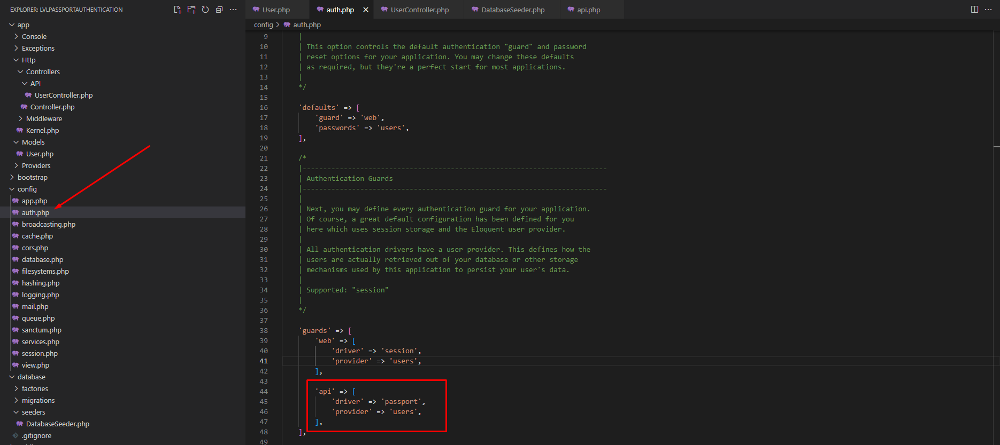
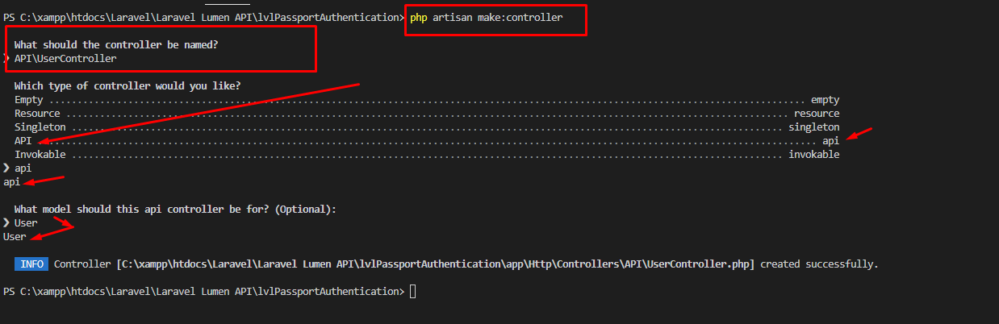
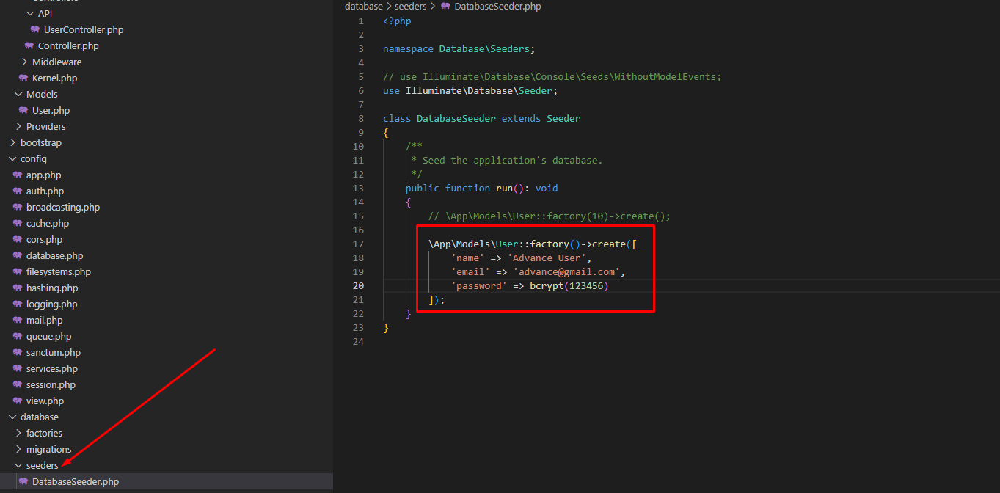
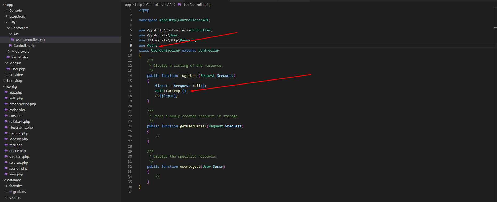

# Passport Installation error guide
> *  add laravel passport version in composer.json
> *  CMD : update composer
> *  Install laravel passport : composer require laravel/passport

### Install laravel passport
1. CMD: composer require laravel/passport
2. CMD: php artisan migrate
3. CMD: php artisan passport:install

### Replace user model
* use Laravel\Passport\HasApiTokens;

### Change auth.php under config folder in guard section

